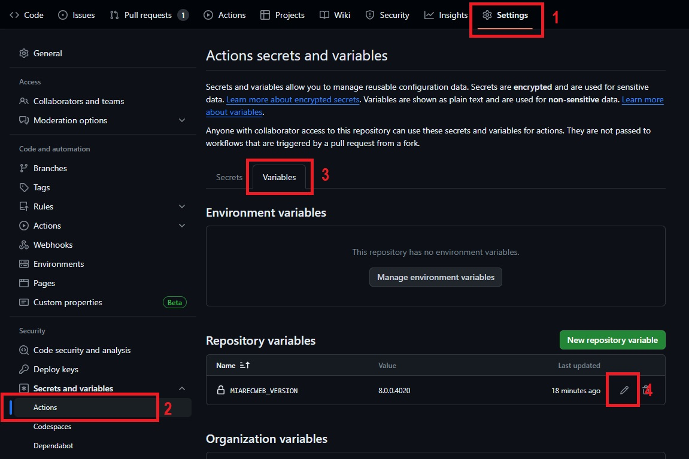
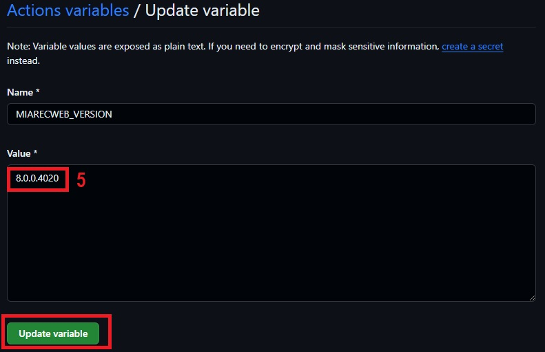

# CI/CD
Github actions are used to unit test this role with Molecule

## Setting `miarecweb_version`
To change the version of miarecweb that will be tested,

From the Repository page,
1. Select `Settings`
2. From `Security > Secrets and Variables`, Select `Actions`
3. Select the `Variables` tab
4. Edit the `MIARECWEB_VERSION` varaible
5. Set the desired value
6. Select `Update Variable`

